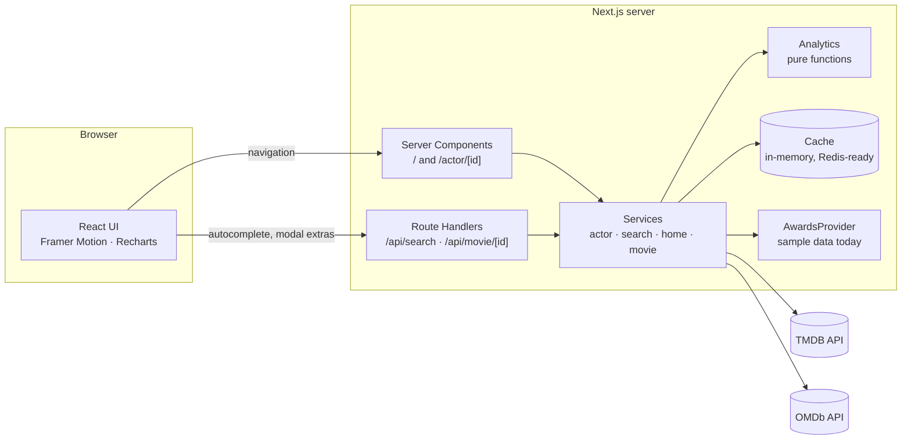

# Marquee

[🌐 Live Demo](https://marquee-nine-inky.vercel.app/)
**The numbers behind the stars.** Search any actor and get a career analysis: ratings over time, box office, genre mix, awards, frequent collaborators and a timeline of the films that mattered.

Built with Next.js 16 (App Router), React 19, TypeScript (strict), Tailwind CSS 4, Framer Motion and Recharts. Data comes from [TMDB](https://www.themoviedb.org/) (primary) and [OMDb](https://www.omdbapi.com/) (optional IMDb / Rotten Tomatoes / Metascore).

## Features

- **Autocomplete search**: debounced, cancels stale requests, keyboard navigable (↑ ↓ Enter Esc), accessible combobox.
- **Actor profile**: portrait, biography, birthplace, career span, external links.
- **Headline stats** with count-up numbers: films, average rating, box office, career length, Oscar wins and nominations.
- **Career ratings chart**: every film as a dot (size = vote count) with a rolling-average trend line and a poster tooltip. Works with mouse and keyboard.
- **Box office**: top-grossing films, total, average, best decade.
- **Genre distribution**: donut chart, shares always add up to exactly 100%.
- **Awards**: grouped by ceremony behind a swappable provider (see [Awards](#awards)).
- **Career highlights, frequent collaborators, career timeline.**
- **Filmography**: sort, filter by type and genre, paginated, with a detail modal that lazy-loads runtime, budget and IMDb / Rotten Tomatoes scores.
- Loading skeletons, empty states for every missing-data case, error and 404 pages, reduced-motion support, responsive down to phones.

## Architecture



**Profile load** (`/actor/[id]`), the important flow:

1. One TMDB request returns the person **and their whole filmography** (`append_to_response=combined_credits,external_ids`).
2. For the ≤40 most significant films, a details request (`append_to_response=credits`) adds revenue, budget, director and cast. Eight run at a time. Awards are fetched in parallel.
3. Everything is normalised into app models (`Title`, `Actor`, …), so components never see raw TMDB shapes.
4. `computeActorAnalytics()` derives every statistic from those models with pure, unit-tested functions.
5. The finished profile is cached for 6 hours, so a repeat visit costs zero API calls.

### Folder structure

```
app/                     routes: landing, actor/[id], api/*, loading / error / not-found
components/
  home/ search/ actor/ movie/ ui/ layout/
lib/
  api/         one thin client per external service (tmdb, omdb, awards, http)
  services/    orchestration + normalisation (raw API shapes → app models)
  analytics/   pure functions: ratings, revenue, genres, career, collaborators, filmography
  cache/       CacheStore interface + in-memory implementation
  utils/       formatting, errors, concurrency helpers
  data/        sample awards dataset
  config.ts    every tunable number in one place
types/         raw TMDB types (server only) and the app's own models
tests/         unit tests for the analytics layer
scripts/       mock-tmdb.mjs: offline TMDB stand-in
```

### Design decisions worth knowing

- **API keys never reach the browser.** All upstream calls happen on the server.
- **Raw API types are confined** to `lib/api` and `lib/services/normalize.ts`. Swapping data providers means changing one layer.
- **Missing data is shown as missing** ("—" or an empty state), never as `0`.
- **Analytics are pure functions** with no I/O, which makes them trivial to test and reason about.
- **Cache is an interface.** Move to Redis by writing one `CacheStore` implementation.

## Getting started

Requires **Node.js 20.9 or newer** (`node -v`).

```bash
npm install
cp .env.local.example .env.local     # then paste your keys into .env.local
npm run dev                          # http://localhost:3000
```

### Environment variables

| Variable | Required | Where to get it |
| --- | --- | --- |
| `TMDB_API_KEY` | **Yes** | Free account at [themoviedb.org](https://www.themoviedb.org/) → Settings → API. Either the "API Key" (v3) or the "API Read Access Token" (v4) works. |
| `OMDB_API_KEY` | No | Free key at [omdbapi.com/apikey.aspx](https://www.omdbapi.com/apikey.aspx). Without it the movie modal simply omits IMDb / Rotten Tomatoes / Metascore. |
| `AWARDS_PROVIDER` | No | `sample` (default). See [Awards](#awards). |
| `TMDB_BASE_URL` | No | Only for the mock server (below). |

Restart `npm run dev` after editing `.env.local`.

### Scripts

| Command | Does |
| --- | --- |
| `npm run dev` | Development server |
| `npm run build` / `npm start` | Production build / serve it |
| `npm run lint` | ESLint |
| `npm run typecheck` | TypeScript, no emit |
| `npm test` | Unit tests (Vitest) |
| `npm run mock` | Offline mock TMDB server |

### Trying it without an API key

The mock server serves synthetic data (fake film titles, clearly labelled). Use two terminals:

```bash
# terminal 1
npm run mock

# terminal 2
TMDB_API_KEY=anything TMDB_BASE_URL=http://localhost:4010/3 npm run dev
```

Search for "Christian Bale", "Margot Robbie" or "Sparse Sample" (a deliberately near-empty profile that exercises every empty state). Set `MOCK_RATE_LIMIT=0.4` on the mock to see the partial-data warning. Poster and portrait images will show their fallbacks, since the mock's image paths don't exist on TMDB.

## Data sources and limits

| Data | Source | Notes |
| --- | --- | --- |
| Filmography, ratings, genres, cast | TMDB | Ratings are TMDB user scores (0-10), and a film needs ≥50 votes to count as rated. |
| Revenue, budget, director, collaborators | TMDB, per film | Only fetched for the ≤40 most significant films to respect rate limits. The UI says how many films the numbers are based on. Revenue is nominal USD (not inflation-adjusted). |
| IMDb, Rotten Tomatoes, Metascore | OMDb | Optional; loaded lazily when a movie modal opens. |
| **Awards** | **Sample dataset** | TMDB has no awards data at all, see below. |

### Awards

TMDB does not provide awards, so awards sit behind an `AwardsProvider` interface (`lib/api/awards.ts`). The default provider reads a small hand-curated dataset (`lib/data/sampleAwards.ts`) that covers a handful of actors: complete Academy Award acting categories, and notable wins only for other ceremonies. The UI labels it as sample data and only shows nomination counts for ceremonies where the list is complete. For any other actor it shows an honest "no awards data" state.

To use a real source later: implement `AwardsProvider` in a new class, register it in `getAwardsProvider()`, and set `AWARDS_PROVIDER`. No UI changes are needed.

## Deployment (Vercel)

1. Push the repository to GitHub.
2. In [Vercel](https://vercel.com/new), **Import** the repository. Framework preset: Next.js (auto-detected).
3. Under **Environment Variables**, add `TMDB_API_KEY` (and optionally `OMDB_API_KEY`) for **Production, Preview and Development**.
4. Deploy. Any push to `main` redeploys automatically.

Or with the CLI: `npm i -g vercel`, then `vercel` (preview) and `vercel --prod`.

Note: the in-memory cache lives per server instance. On serverless platforms each instance warms its own cache, and Next's data cache (`revalidate`) also applies. For a shared cache across instances, implement `CacheStore` with Redis / Upstash.

## Testing

`npm test` runs 45 unit tests over the analytics layer: rating and revenue statistics, decade and genre rankings, collaborator detection, filmography sorting (missing values always last), award tallies, and edge cases (no votes, no revenue, future releases, documentary cameos, same-day releases).

## Future improvements

- A real awards provider (e.g. a licensed dataset) behind the existing interface.
- Redis-backed cache and background refresh of popular profiles.
- Inflation-adjusted box office.
- Compare two actors side by side.
- Shareable chart images and Open Graph cards per actor.
- End-to-end tests (Playwright) in CI.

## Credits

This product uses the TMDB API but is not endorsed or certified by TMDB.
